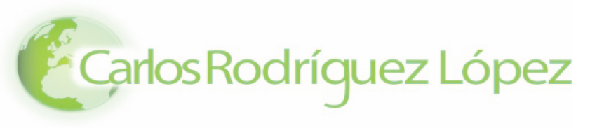
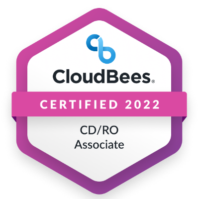
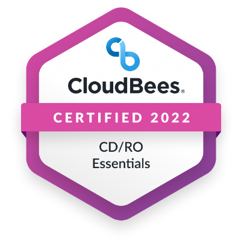
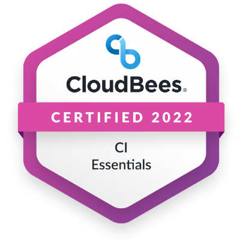
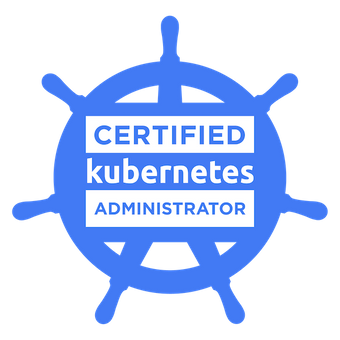
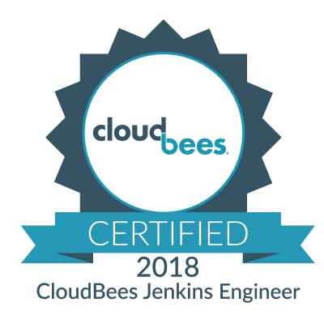

<!-- https://rahuldkjain.github.io/gh-profile-readme-generator/ -->

# Carlos' Profile

Hi 👋,

| | [📖](/docs/)|
|---|---|

## Bio

Automation Consultant embracing the DevOps culture. Background of Java Web and (Geo) Data Management and Analysis. Running CI/CD pipelines in the Cloud.

Working happily at [CloudBees](https://www.cloudbees.com/) in the Professional Service Team, helping customers to love more our CI/CD products!

## My 🔧

### Work Ecosystem

  

  

   

### My Badges

## GitHub

## Knowledge Sharing

### &#x270d; Blog & Writing

- [DR CloudBees in EKS with Velero](https://www.cloudbees.com/blog/), 2022.
- [Support an Interview-As-Code Model](https://stories.jenkins.io/user-story/to-run-technical-simulations-for-developer-engineer-interviews/), 2020.
- [Troubleshooting Jenkins in Kubernetes](https://www.cloudbees.com/blog/apm-tools-jenkins-performance), 2020.
- [Template Catalog: Welcome to the Pipeline as Code Family](https://www.cloudbees.com/blog/pipeline-as-code), 2020.
- [My Experience as a Developer Support Engineer at CloudBees](https://www.cloudbees.com/blog/my-experience-developer-support-engineer-cloudbees), 2019.

### &#128172; Talks

- [DR CloudBees CI EKS with Velero](https://events.devopsworld.com/widget/cloudbees/devopsworld22/conferenceSessionDetails?tab.day=20220928&search=1040). Orlando, EEUU. 2022
- [Combining Serverless Continuous Delivery With ChatOps](https://www.meetup.com/es-ES/SVQJUG/events/263195348/). Sevilla, Spain. 2019

|  |  |
|---| ---|
