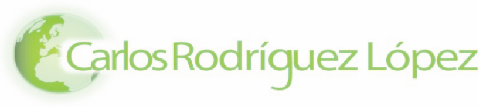

<!-- https://rahuldkjain.github.io/gh-profile-readme-generator/ -->

#

  
  
  
Welcome to my GitHub Organization

---

    

`*` _CV Artifact renders the output from my Linkedin profile exported via [LinkedIn to JSON Resume Browser Tool](https://github.com/joshuatz/linkedin-to-jsonresume) using [CV as JSON](https://jsonresume.org/)_

## About me

I started my career working on [GIS](https://github.com/carlosrodlop/gis) technologies for data workflow analysis and visualizations. Years later, I put my focus on the DevOps culture. Currently, running [CI](https://github.com/carlosrodlop/cbci.jenkins-lib)/CD pipelines in [Kubernetes](https://github.com/carlosrodlop/K8s-lib).

Working happily at [CloudBees](https://www.cloudbees.com/) in the Professional Service Team, helping customers to love more our products!

### Work Ecosystem

  

  

   

### Badges

### ✍ Blog & Writing

- [DR CloudBees in EKS with Velero](https://www.cloudbees.com/blog/), 2022.
- [Support an Interview-As-Code Model](https://stories.jenkins.io/user-story/to-run-technical-simulations-for-developer-engineer-interviews/), 2020.
- Troubleshooting Jenkins in Kubernetes, 2020.
  - [Part 1](https://www.cloudbees.com/blog/apm-tools-jenkins-performance)
  - [Part 2](https://www.cloudbees.com/blog/application-performance-monitoring-tools)
- [Template Catalog: Welcome to the Pipeline as Code Family](https://www.cloudbees.com/blog/pipeline-as-code), 2020.
- [My Experience as a Developer Support Engineer at CloudBees](https://www.cloudbees.com/blog/my-experience-developer-support-engineer-cloudbees), 2019.
- [GIS for USLE in Guadalfeo Watershed](https://github.com/carlosrodlop/gis/blob/master/usle-guadalfeo/dis_BScEnvSC_carlosrodlop.pdf), 2006.

### 🗣 Talks

- [DR CloudBees CI EKS with Velero](https://events.devopsworld.com/widget/cloudbees/devopsworld22/conferenceSessionDetails?tab.day=20220928&search=1040). Orlando, EEUU. 2022
- [Combining Serverless Continuous Delivery With ChatOps](https://www.meetup.com/es-ES/SVQJUG/events/263195348/). Sevilla, Spain. 2019

## About my organization

[carlosrodlop/carlosrodlop](https://github.com/carlosrodlop/carlosrodlop) repository is the landing to my organization [carlosrodlop](https://github.com/carlosrodlop). In addition, this repository gathers common resources to my shared globally and organized into submodules to [Secrets](https://github.com/carlosrodlop/carlosrodlop-secrets), [Workstation Configuration](https://github.com/carlosrodlop/carlosrodlop-conf) and [Documentation](https://github.com/carlosrodlop/carlosrodlop-docs).

This organization is used to create Proof of Concept on different Technologies following this [Security Manifesto](SECURITY_MANIFESTO.md). Repositories libraries host reusable code per Area of Knowledge and/or Languages such as [Docker](https://github.com/carlosrodlop/docker-lib), [Kubernetes](https://github.com/carlosrodlop/K8s-lib), [Terraform](https://github.com/carlosrodlop/terraform-lib), [CloudBees/Jenkins](https://github.com/carlosrodlop/cbci.jenkins-lib), Java, etc.

### Stats 📊

<!-- Not wrking

  

-->

  

