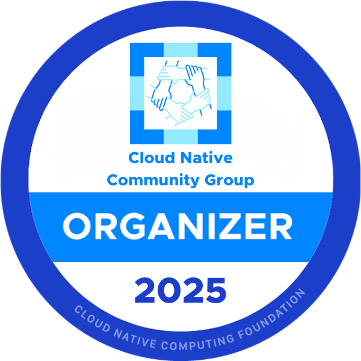
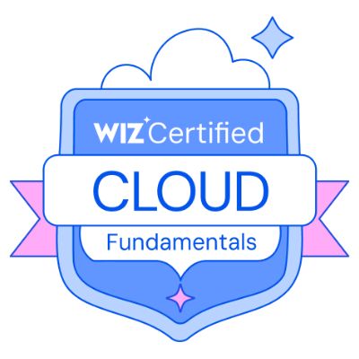
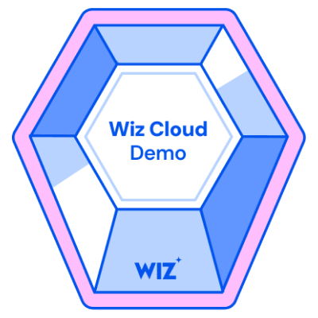
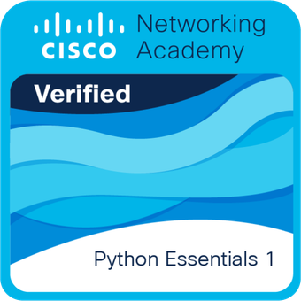
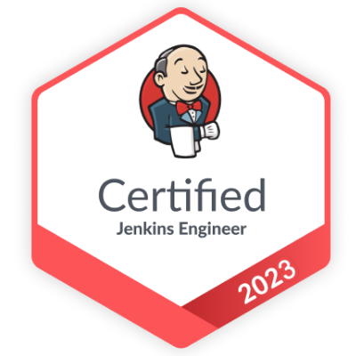
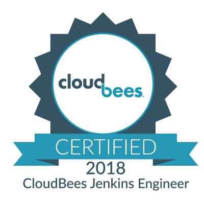

<!-- https://rahuldkjain.github.io/gh-profile-readme-generator/ -->

  
  
  
Welcome to my GitHub Organization

---

    

`*` _CV Artifact renders the output from my Linkedin profile exported via [LinkedIn to JSON Resume Browser Tool](https://github.com/joshuatz/linkedin-to-jsonresume) using [CV as JSON](https://jsonresume.org/)_

## About me

I am a Consultant specializing in DevSecOps and Cloud Computing, dedicated to helping customers succeed throughout their product adoption journey with software solutions.

Currently, I am part of CloudBees, a leading provider of enterprise-grade continuous integration and delivery (CI/CD) solutions. I transitioned from a Support role to Services, where I co-lead internal projects for Architecture Blueprints and the reduction of Cloud Footprint in the team, alongside my client-facing responsibilities.

Beyond my role at CloudBees, I co-organize Cloud Native Sevilla, a local chapter of the Cloud Native Computing Foundation (CNCF). Through this community, I help foster the adoption of cloud-native technologies and practices.

Previously, I gained experience as Java Web Developer and GIS DBA and Developer where I contributed to projects for different sectors like Urban Planning, Telecom and Energy.

### Badges

### ✍ Blog & Writing

- [CloudBees CI EKS Terraform Add-on](https://www.cloudbees.com/blog/deploy-cloudbees-ci-to-amazon-web-services-aws-elastic-kubernetes-service), 2023.
- [DR CloudBees in EKS with Velero](https://www.cloudbees.com/blog/cloudbees-ci-disaster-recovery-dr-proof-of-concept-using-velero), 2022.
- [Support an Interview-As-Code Model](https://stories.jenkins.io/user-story/to-run-technical-simulations-for-developer-engineer-interviews/), 2020.
- Troubleshooting Jenkins in Kubernetes, 2020.
  - [Part 1](https://www.cloudbees.com/blog/apm-tools-jenkins-performance)
  - [Part 2](https://www.cloudbees.com/blog/application-performance-monitoring-tools)
- [Template Catalog: Welcome to the Pipeline as Code Family](https://www.cloudbees.com/blog/pipeline-as-code), 2020.
- [My Experience as a Developer Support Engineer at CloudBees](https://www.cloudbees.com/blog/my-experience-developer-support-engineer-cloudbees), 2019.
- [GIS for USLE in Guadalfeo Watershed](https://github.com/carlosrodlop/gis/blob/master/usle-guadalfeo/dis_BScEnvSC_carlosrodlop.pdf), 2006.

### 🗣 Talks

- Jenkins at 20: Scaling CI/CD Pipelines in the Cloud-Native Era with EKS Blueprints. 
  - [Madrid CNCF Local Group, 2024](https://community.cncf.io/events/details/cncf-cloud-native-madrid-presents-cloud-native-madrid-ryanair/)
  - [Lisbon AWS & CNCF Local Group, 2024](https://community.cncf.io/events/details/cncf-cloud-native-lisbon-presents-19-cnl-meetup-cloud-native-lisbon-aws-user-group-lisbon/)
  - [London CNCF Local Group, 2025](https://www.meetup.com/cloud-native-london/events/305905095/)
- [Cloud Friendly Jenkins](https://community.cncf.io/events/details/cncf-cloud-native-sevilla-presents-cloud-friendly-jenkins-amp-calico-network-policies/). Sevilla CNCF Local Group, 2024.
- [DR CloudBees CI EKS with Velero](https://events.devopsworld.com/widget/cloudbees/devopsworld22/conferenceSessionDetails?tab.day=20220928&search=1040). DevOps World Orlado (EEUU), 2022.
- [Combining Serverless Continuous Delivery With ChatOps](https://www.meetup.com/es-ES/SVQJUG/events/263195348/). Sevilla Java Meetup Group, 2019.

## About my organization

I follow the "Everything as Code" (EaC) principle for my daily work.

The [carlosrodlop/carlosrodlop](https://github.com/carlosrodlop/carlosrodlop) repository is the landing gate to my organization [carlosrodlop](https://github.com/carlosrodlop) and gathers common resources which are organized into submodules for [Secrets](https://github.com/carlosrodlop/carlosrodlop-secrets), [Workstation Configuration](https://github.com/carlosrodlop/carlosrodlop-conf) and [Documentation](https://github.com/carlosrodlop/carlosrodlop-docs).

This organization hosts Proof of Concept on different Technologies and their integrations following the [DRY](https://en.wikipedia.org/wiki/Don%27t_repeat_yourself) principle and this [Security Manifesto](https://github.com/carlosrodlop/carlosrodlop-docs/blob/main/SECURITY_MANIFESTO.md). Repositories libraries are organized per Area of Knowledge and/or Languages such as [Docker](https://github.com/carlosrodlop/docker-lib), [Kubernetes](https://github.com/carlosrodlop/K8s-lib), [Terraform](https://github.com/carlosrodlop/terraform-lib), [CloudBees/Jenkins](https://github.com/carlosrodlop/cbci.jenkins-lib), etc.

### Stats 📊

<!-- Not wrking

  

-->

  

    
  

  

    
  

